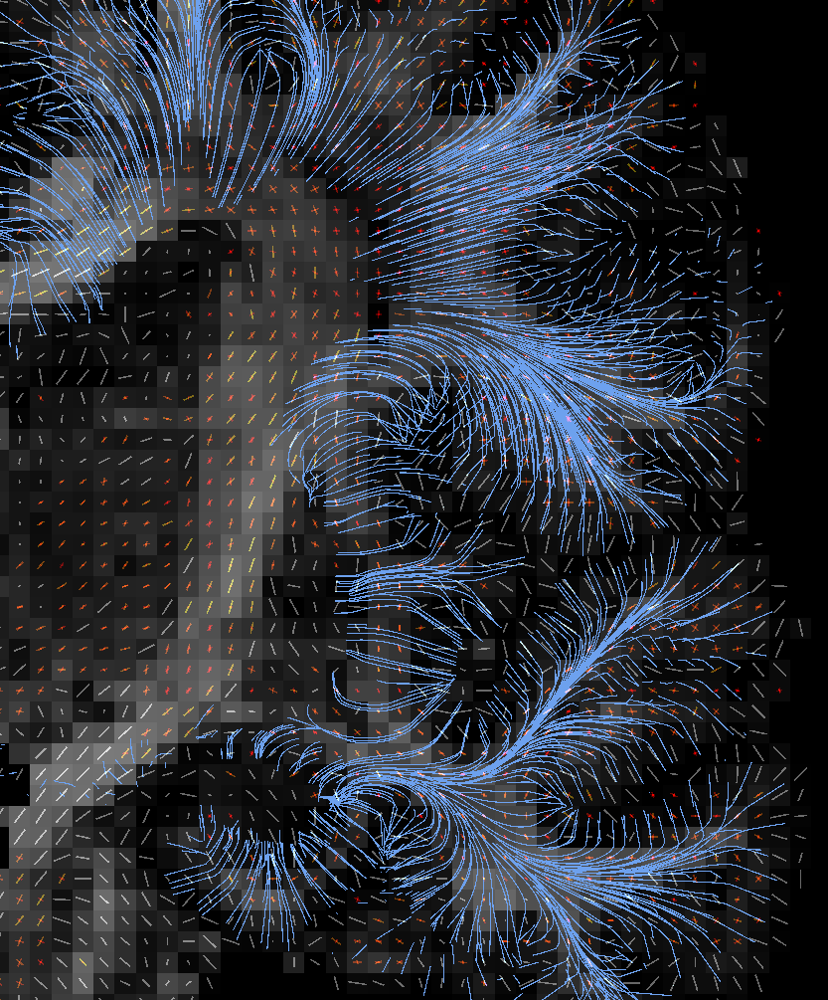

# corticalDWI
Tools to sample DWI metrics on the cortex and superficial white matter

Functions and scripts not included here can be found at https://github.com/lconcha/inb_tools

Please note that this pipeline uses a modified version of mrtrix, which should be [downloaded](https://github.com/lconcha/mrtrix3) and compiled first.

