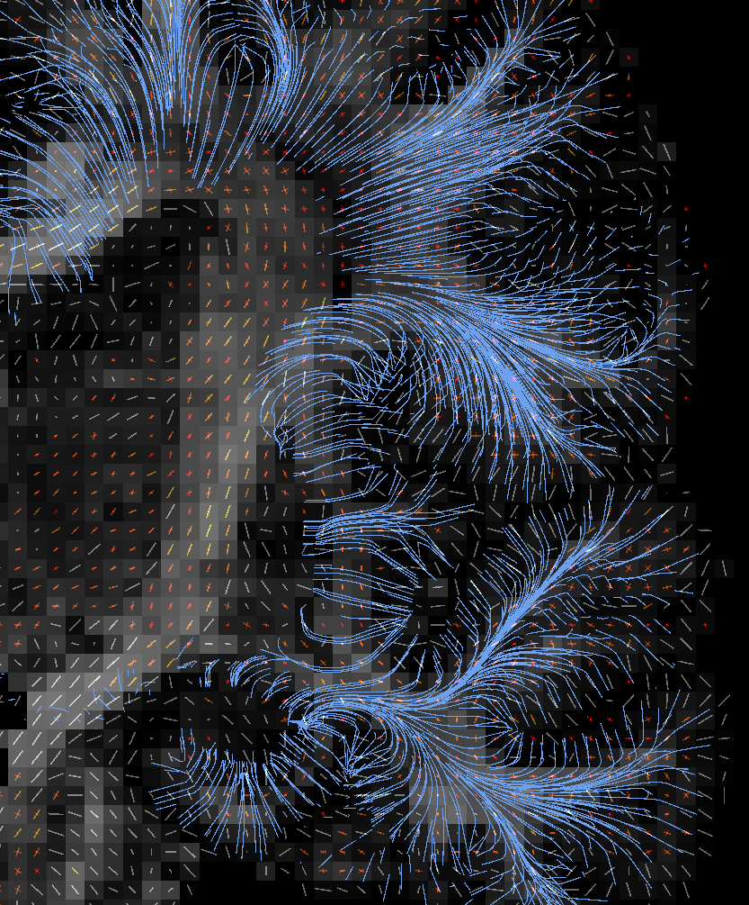

# corticalDWI
Tools to sample DWI metrics on the cortex and superficial white matter

Functions and scripts not included here can be found at https://github.com/lconcha/inb_tools

Please note that this pipeline uses a custom module for mrtrix,  which should be [downloaded](https://github.com/lconcha/inb_mrtrix_modules) and compiled first.

## Tutorial
Please see [here](./tutorial.md).

