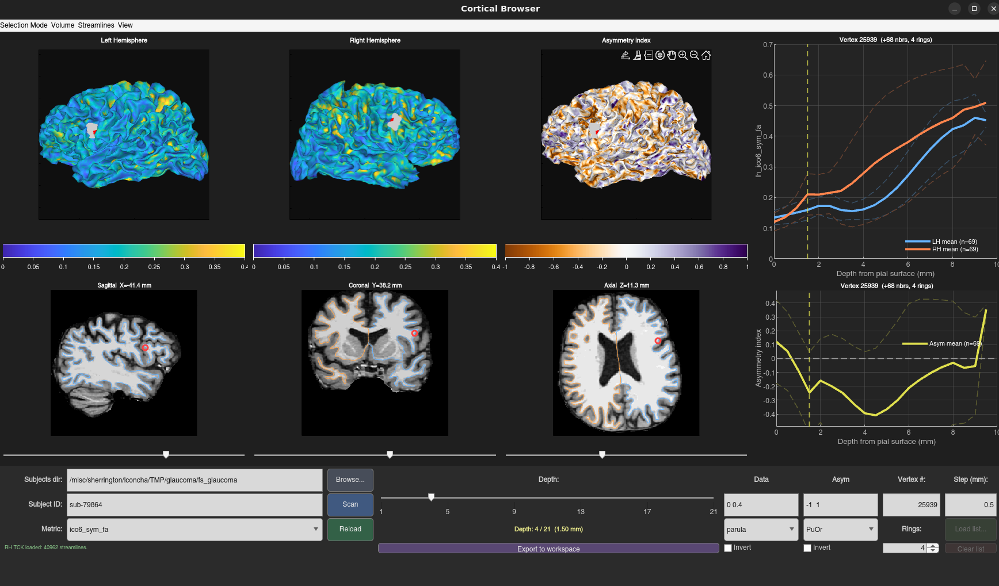
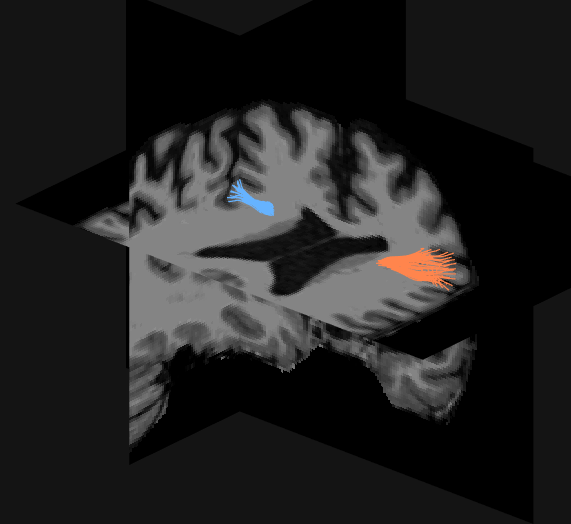

# Cortical Browser — User Manual

`cortical_browser_2.m` is an interactive MATLAB GUI for exploring cortical diffusion MRI depth-profile data. It displays bilateral hemisphere surfaces with overlay metrics, orthogonal MRI slices, depth-profile plots, and (optionally) associated streamlines.




---

## Layout

```
┌──────────────────┬──────────────────┬──────────────────┬──────────────────┐
│  Left Hemisphere │ Right Hemisphere │  Asymmetry index │  Depth profile   │
│   (3D surface)   │   (3D surface)   │   (3D surface)   │     (plot)       │
├──────────────────┼──────────────────┼──────────────────┼──────────────────┤
│    Sagittal      │     Coronal      │      Axial       │ Asymmetry index  │
│   (orthoslice)   │   (orthoslice)   │   (orthoslice)   │     (plot)       │
│  [slider]        │  [slider]        │  [slider]        │                  │
├──────────────────────────────────────────────────────────────────────────-─┤
│                         Control panel                                       │
└────────────────────────────────────────────────────────────────────────────┘
```

Orthoslices are displayed in **radiological orientation** (patient right on viewer's left).

---

## Getting Started

1. Set **Subjects dir** and **Subject ID** in the control panel.
2. Click **Scan** to discover paired surface and TSF files for that subject.
3. Select a **Metric** from the dropdown and click **Reload** to load and render the data.
4. A `brain.mgz` (or `brain.nii[.gz]`) is loaded automatically from the subject's `mri/` folder if present.

---

## Control Panel

| Control | Description |
|---|---|
| **Subjects dir** / Browse | FreeSurfer subjects directory path |
| **Subject ID** | Subject folder name |
| **Scan** | Discover all TSF metric files for the subject |
| **Reload** | Load the selected metric and render surfaces |
| **Depth slider** | Select the cortical depth layer shown on surfaces |
| **Depth label** | Shows current depth index, total depths, and mm from pial surface |
| **Step (mm)** | Physical distance between depth steps |
| **Data CLim** | Color limits for LH/RH surfaces (e.g. `0  1`) |
| **Asym CLim** | Color limits for the asymmetry surface (e.g. `-1  1`) |
| **Vertex #** | Manually enter a vertex index to select it |
| **Metric** | Dropdown of discovered metric names |
| **Data colormap** | Colormap for LH/RH surface overlay |
| **Asym colormap** | Colormap for the asymmetry surface |
| **Invert** (×2) | Invert the data or asymmetry colormap |
| **Rings** | Number of neighborhood rings around the selected vertex |
| **Load list…** | Load a text file of vertex IDs (one per line, 1-based) |
| **Clear list** | Return to single-vertex click mode |
| **Export to workspace** | Export depth profiles and metadata to the MATLAB base workspace |
| **Status bar** | Displays the current state, loaded file, and vertex/depth counts |

---

## Menus

### Selection Mode
| Item | Description |
|---|---|
| **Click vertex** | Click on any surface to select the nearest vertex |
| **Load vertex list** | Aggregate mode: load a list of vertex IDs; plots show their mean ± SD |

### Volume
| Item | Description |
|---|---|
| **Load volume…** | Load an MRI volume (`.nii`, `.nii.gz`, or `.mgz`) for the orthoslice panels. MGZ files are converted via `mrconvert` behind the scenes |
| **Show coordinate diagnostics** | Print affine transform details to the MATLAB console |

### Streamlines
| Item | Description |
|---|---|
| **Load LH TCK…** | Load a MRtrix `.tck` file for the left hemisphere (one streamline per surface vertex, same index order) |
| **Load RH TCK…** | Load a MRtrix `.tck` file for the right hemisphere |
| **Clear streamlines** | Unload TCK data and close the streamline viewer window |



### View
| Item | Description |
|---|---|
| **LH surface** | Show/hide the left hemisphere surface panel |
| **RH surface** | Show/hide the right hemisphere surface panel |
| **Asym surface** | Show/hide the asymmetry surface panel |
| **Sagittal slice** | Show/hide the sagittal orthoslice panel |
| **Coronal slice** | Show/hide the coronal orthoslice panel |
| **Axial slice** | Show/hide the axial orthoslice panel |
| **Depth profile** | Show/hide the depth profile plot |
| **Asymmetry profile** | Show/hide the asymmetry depth-profile plot |

---

## Keyboard Shortcuts

| Key | Action |
|---|---|
| `←` Left arrow | Sagittal: previous slice |
| `→` Right arrow | Sagittal: next slice |
| `Page Up` | Coronal: next slice |
| `Page Down` | Coronal: previous slice |
| `↑` Up arrow | Axial: next slice (superior) |
| `↓` Down arrow | Axial: previous slice (inferior) |

> The figure window must have keyboard focus for shortcuts to work. Click anywhere on it first.

---

## Interacting with Surfaces

- **Click** on any of the three surface panels to select the nearest vertex.
- The selected vertex is highlighted with a red dot on all three surfaces.
- Neighbor vertices (within the specified ring count) are shown as orange dots.
- The orthoslice panels **snap to the selected vertex** world coordinates automatically.
- A red circle marks the vertex projection on each orthoslice panel.
- The depth-profile and asymmetry plots update to show the selected vertex (and its neighbors if Rings > 0).

### Rings
Setting **Rings > 0** expands the selection to include mesh neighbors within that many edge-hops. The plots show:
- Individual thin lines for each vertex (up to 100)
- Mean ± 1 SD as dashed lines when more than 100 vertices are selected

---

## Orthoslice Panels

- Each panel shows a 2D cross-section of the loaded volume.
- **Sliders** below each panel scroll through slices.
- **Zoom and pan** with standard MATLAB tools; the view is preserved across slice changes. Double-click to reset.
- **Surface contours** (blue = LH, orange = RH) are overlaid at the current slice position.
- **Red circle** marks the selected vertex projection (in click-vertex mode).
- Clicking a surface vertex **snaps all three slices** to the vertex world coordinate.

---

## Depth-Profile Plots

Two plots are shown:
1. **Depth profile** — LH (blue) and RH (orange) metric values from pial surface inward.
2. **Asymmetry profile** — `(LH − RH) / mean(LH, RH)` per depth, with a zero reference line.

A vertical line marks the currently selected depth layer. The x-axis shows distance from the pial surface in mm.

---

## Streamline Viewer

When TCK files are loaded, selecting a vertex opens a separate 3D **Streamline Viewer** figure showing:
- The streamlines associated with the selected vertex (and neighbors if Rings > 0), colored by hemisphere.
- Orthoslice planes (from the loaded volume) at the current slice positions — these rotate with the 3D view.
- The viewer updates automatically when the vertex selection or slice position changes.
- The camera angle is preserved between updates; rotate freely and continue clicking.

---

## Vertex List Mode

1. Prepare a plain-text file with one **1-based** vertex index per line.
2. Select **Selection Mode → Load vertex list**, then click **Load list…**.
3. The plots aggregate all listed vertices (mean ± SD or shaded band).
4. Click **Clear list** or switch back to **Click vertex** to return to single-vertex mode.

---

## Export to Workspace

Clicking **Export to workspace** sends the following variables to the MATLAB base workspace:

| Variable | Content |
|---|---|
| `exported_depths` | Depth axis in mm |
| `exported_lh` | LH depth profiles for active vertex set (n × nDepths) |
| `exported_rh` | RH depth profiles for active vertex set (n × nDepths) |
| `exported_asym` | Asymmetry index profiles (n × nDepths) |
| `exported_vertices` | Active vertex indices |
| `exported_metric` | Metric name string |

---

## Dependencies

| Toolbox / Function | Source |
|---|---|
| `read_surface` | BrainStat MATLAB toolbox |
| `read_mrtrix_tsf`, `read_mrtrix_tracks` | MRtrix3 MATLAB tools |
| `cortical_cell2mat` | This repository |
| `cbrewer` | cbrewer toolbox (for diverging colormaps) |
| GIfTI reader (`gifti`) | GIfTI MATLAB library |
| `mrconvert` | MRtrix3 (system binary, used for MGZ conversion) |

Run `cortical_matlab_setup()` to add all paths, or call it is called automatically at startup.

---

## Notes

- **MGZ volumes** are converted on-the-fly to a temporary NIfTI file via `mrconvert` and deleted after loading. The original filename is retained in the status bar.
- On Linux, MATLAB's `LD_LIBRARY_PATH` is temporarily unset for `mrconvert` calls to avoid library conflicts.
- Vertex indices throughout the GUI are **1-based** (MATLAB convention).
- The asymmetry index is defined as `(LH − RH) / ((LH + RH) / 2)`, i.e., a fractional difference relative to the bilateral mean.

---

```html
<video controls width="640" src="figures/cortical_browser.webm">
	Your browser does not support the video tag. <a href="figures/cortical_browse.webm">Download the video</a>
</video>
```
