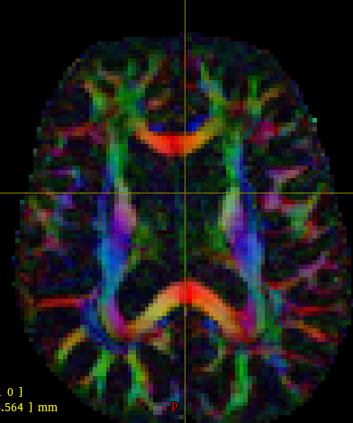
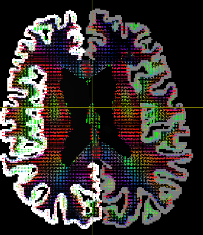
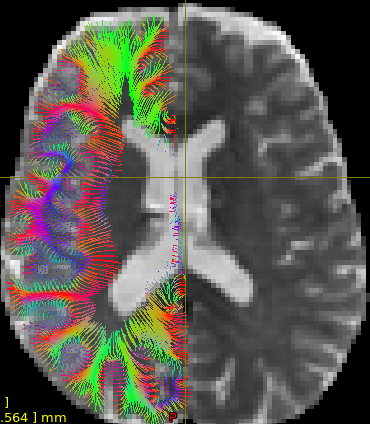
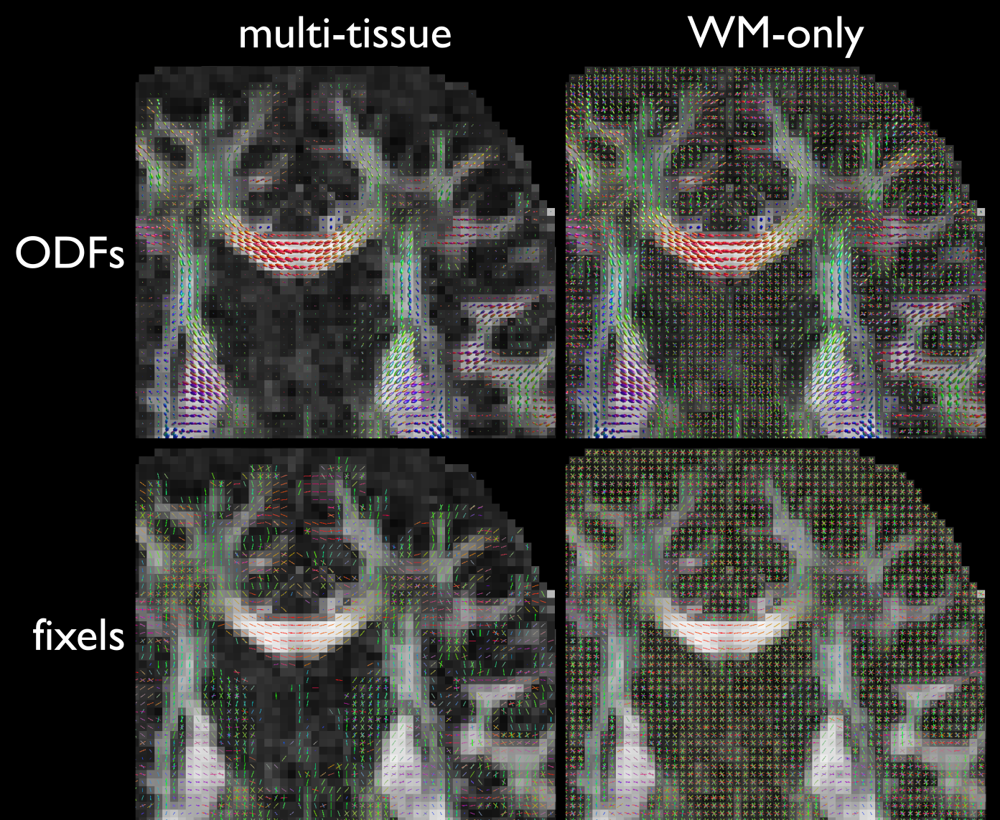

# Diffusion analysis of the cortex and superficial WM

This tutorial will show all the steps necessary to run the entire pipeline for the analysis of dMRI-derived metrics within the cortex and the superficial WM (SWM). **Please get in contact with us if you plan to use this pipeline.**

# Requirements
## Software
This pipeline includes several tools scattered around many different software suites, as well as some custom-made scripts and tools. In this tutorial we are using the computing cluster at the Institute of Neurobiology, at UNAM, where the tools are already installed. You may need to install them manually outside of our cluster. Some day we will create a singularity/apptainer container, but in the meantime here is the list of tools needed:

* [mrtrix3](https://mrtrix.readthedocs.io/en/latest/)
* [freesurfer](https://surfer.nmr.mgh.harvard.edu/)
* [ANTs](https://surfer.nmr.mgh.harvard.edu/)
* [workbench](https://www.humanconnectome.org/software/get-connectome-workbench)
* [micapipe](https://micapipe.readthedocs.io/en/latest/)
* [inb_tools](https://github.com/lconcha/inb_tools) (a collection of command-line tools used at our Institute).
* Custom-made [mrtrix modules](https://github.com/lconcha/inb_mrtrix_modules).

## Data
High-resolution, high-quality, multi-shell DWIs are needed. The very first steps of the pipeline assume the data is organized in BIDS format, but this is just a formality, as the pipeline is not a bona fide bids app. Data should be pre-processed and inside the `derivatives/` directory. Pre-processing of DWIs can be done with mrtrix's `dwifslpreproc`, but we love the denoiser in [Designerv2.](https://nyu-diffusionmri.github.io/DESIGNER-v2/)

For the purpose of this tutorial we have: 

```bash=
bids_dir=/misc/nyquist/danielacoutino/glaucoma/bids
subjid=sub-79864
```


# Run freesurfer
Create the directory where freesurfer outputs will be stored.  **All outputs from the corticalDWI pipeline are stored within this folder**. In this example, we set it to `/misc/sherrington/lconcha/TMP/glaucoma/fs_glaucoma`

## Prepare environment
In our cluster this is easy:

```bash
module load freesurfer/7.3.2
export SUBJECTS_DIR=/misc/sherrington/lconcha/TMP/glaucoma/fs_glaucoma
```
## Run freesurfer
First we prepare the inputs:
```bash
recon-all -subjid $subjid -i $bids_dir/${subjid}/anat/${subjid}_T1w.nii.gz
```
Then we run freesurfer:
```
fsl_sub -N $subjid -s smp,40 recon-all -threads 40 -subjid $subjid -all
```
As usual with freesurfer, it is now time to go do something else, drink some coffee, or read that stack of pdfs that keeps staring at you.

<details>
<summary>Details on SGE and SGE</summary>
Note that we are using `fsl_sub` to submit the job to the cluster. The `-N` flag just gives it a pretty name we can track using `qstat`, and `-s smp,40` assigns 40 slots to this job in a parallel environment. This is just a trick so that I know that my job is executed by a powerful PC (`qhost` can be used to examine the cluster capabilities). `-threads 40` is a flag for freesurfer (not for SGE), and instructs the program to use at most 40 threads, which we made it correspond to the slots requested in SGE.
</details>

### Check freesurfer output
Always make sure that your surface estimations are good. If not, refer to freesurfer's documentation and tutorials to [fix the surfaces using control points and/or voxel edits](https://sites.bu.edu/cnrlab/lab-resources/freesurfer-quality-control-guide/freesurfer-quality-control-step-1-fix-pial-surface/). 

One can check the surfaces with a command similar to:

```bash
freeview -v ${SUBJECTS_DIR}/$subjid/mri/brain.mgz -f ${SUBJECTS_DIR}/$subjid/surf/?h.{white,pial}
```


# Running corticalDWI
First we must prepare our environment, this will call for things in our `micapipe` environment.

```bash
module load freesurfer/7.3.2 ANTs/ workbench_con/
export SUBJECTS_DIR=/misc/sherrington/lconcha/TMP/glaucoma/fs_glaucoma; # do not forget to set this after any time you load the freesurfer module. We had already loaded it, it is here just as a reminder that the pipeline works well on v7.3.2
conda activate micapipe  # crucial to do after module load to get the correct python in path
```

And, of course, add the corticalDWI repository (and `inb_tools`, if needed) to your PATH. In my case:
```bash
corticalDWI_repo=/datos/lauterbur2/lconcha/nobackup/MOVED_lauterbur/code/corticalDWI
export PATH=${corticalDWI_repo}:$PATH
```

## Add the DWIs to the freesurfer file structure
This relies on a well-organized bids directory with the pre-processed dwi file. Soon we will add an option to manually specify the dwi file, but in the meantime...
```bash
 cortical_add_dwi_to_freesurfer.sh $subjid $bids_dir
```
This creates a `dwi/` folder inside the `$SUBJECTS_DIR/$subjid` directory:
```init
sub-79864/dwi
├── ad.nii.gz
├── b0.nii.gz
├── dt.nii.gz
├── dwi.bval
├── dwi.bvec
├── dwi.nii.gz
├── dwi.scheme
├── fa.nii.gz
├── mask.nii.gz
├── md.nii.gz
├── rd.nii.gz
└── v1.nii.gz
```

Check your newly-created DTI maps:
```bash
 mrview $SUBJECTS_DIR/$subjid/dwi/{v1,fa,b0,md}.nii.gz
```




## Computing Laplacian field

Define parameters

```bash
nsteps=100
step_size="0.1"
tck_step_size=0.5
target_type=fsLR-32k
```
And get your Laplacians.

```bash
cortical_compute_laplacian.sh $subjid
```

Results are saved in the `mri` folder, since the Laplacian field is calculated in the T1 native space. Later on we will be able to move the laplacian streamlines to the dwi space. Check your result:

```bash
mrview ${SUBJECTS_DIR}/$subjid/mri/aparc+aseg.nii.gz -fixel.load $subjid/mri/laplace-wm_vec.nii.gz
```



## Resample surfaces
This resamples the freesurfer's white and pial surfaces to whatever `$target_type` you want, typically `fsLR-32k`. It will also create surfaces with scanner coordinates, which we will use to compute the streamlines in the next step. Results are saved in the `surf` folder.
```bash
for hemi in lh rh; do
  for surf_type in white pial; do
    cortical_resample_surface.sh $subjid $hemi $surf_type $target_type
  done
done
```
## Compute streamlines
```bash
for hemi in lh rh; do
  cortical_compute_streamlines.sh $subjid $hemi $target_type $nsteps $step_size
done
```
When each of these finishes, you can see in cyan the suggested command to check the results in mrview. It should look something like this:


## Register T1/dwi
This step uses `mri_synthseg` to segment both T1 and the DWIs, followed by registration of these two segmentations via ANTs. Ideally, use a PC with at least 32 GB of RAM and plenty of CPU threads.
```bash
cortical_register_t1_to_dwi.sh $subjid
```

The command itself will tell you how to check your results. Use the <kbd>PgUp</kbd> and <kbd>PgDn</kbd> keys to switch between volumes, and make sure that the registration is as good as can be. Check the cortex in the frontal and temporal poles.


## Warp streamlines to DWI space
Streamlines were created in t1 native space, because that is where the surfaces were generated. However, what we want to sample is in dwi space. Now, _we could_ transform all DWI-derived maps to t1 space and sample there, but that would be a hassle, since we would need to transform all vector-related stuff (fixels, principal diffusion directions, etc). So, instead we bring the t1-derived streamlines over to the dwi world.
```bash
for hemi in lh rh; do
  cortical_warp_tck_to_dwi.sh $subjid $hemi $target_type $tck_step_size
done
```
When the script finishes, it will tell you how to visualize the results, go ahead and check that the streamlines are truly in dwi space. This is crucial, or else we will sample some other trash!




## Resample and truncate the streamlines
To ensure correct sampling as a function of depth from the pial surface, we should ensure equidistant points between the vertices of each streamline according to our desired spatial sampling rate (step size). While we're at it, we truncate the streamlines after a certain depth. This will allow us to visualize only what we are truly sampling.

```bash
cortical_tckresample_and_truncate_tck.py rh_fsLR-32k_laplace-wm-streamlines_dwispace.tck now.tck --step_size 0.5 --max_length 8
```


## CSD
Now we compute constrained spherical deconvolution across the entire brain, including the fixels directory that we will then use to extract apparent fiber density per fixel.

```bash
cortical_CSD.sh $subji
```

Two versions of CSD will be computed, each with its own advantages and disadvantages.

* **Multi-shell multi-tissue.** This creates beautiful FODs all throughout the brain. It is very favoured by folks doing tractography, as the WM fods are sharper and cleaner from partial volume effects of gray matter and CSF. However, since the response function for gray matter is spherical on purpose, it is impossible to obtain per-bundle AFD metrics in the cortex. So, this may be a good option for analysis of superficial white matter, but not so much for intra-cortical analysis.
* **Multi-shell single tissue.** A single response functio is estimated for white matter, and applied throughout the brain, even in the cortex. This effectively allows us to obtain per-bundle metrics (AFD) in the cortex. There is a possibility of finding spurious fixels in the cortex that arise from diffusion of mostly isotropic components therein, but we assume here that any large fixels correspond to "neurites", which should have a response function similar to that found in deep white matter. This is an important assumption, and something to always consider when intepreting results.



## MRDS
Here we fit one, two, or three tensors to each voxel throughout the brain using multi-resolution discrete search [(Coronado-Leija, Ramírez-Manzanares & Marroquín, 2017)](https://doi.org/10.1016/j.media.2017.06.008). The optimal number of tensors that best explain the underlying signal (per voxel) is estimated with Bayes' information criterion (BIC). This is a _very_ time-consuming step, expect around 24 per subject on a multi-core workstation! You have been warned! 

```bash
cortical_MRDS.sh $subjid
```
:information_source: Let's focus on CSD for this tutorial and skip MRDS.


## Sample fixels
Ah, the final frontier! Let's get the AFD values along the laplacian streamlines, separating those derived from the FODs mostly aligned parallel to the streamline, to those that are perpendicular to it; the first is related to radial fibers entering and exiting the cortex to and from the deep white matter, while the second represents fibers running tangential to the pial surface, likely inter-columnar fibers (within the cortex) and U-fibers (in the superficial white matter). To make nomenclature clear:


| Geometric relation to Laplacian streamline | Fiber population | Biological interpretation        |
|--------------------------------------------|------------------|----------------------------------|
| parallel                                   | radial fibers    | cortical afferents and efferents |
| perpendicular                              | tangential       | inter-columnar and U-fibers      |

In this tutorial we will sample the single-tissue fixels, so that we get (meaningful) results from the voxels within the cortical ribbon.

We must have the custom-made mrtrix modules in our `$PATH`. They can be obtained [here](https://github.com/lconcha/inb_mrtrix_modules). These modules are modifications (hacks, really) of the commands `tckfixel` and `tcksample` in the original mrtrix implementation. The modification allows for:
* the calculation of the dot product between each streamline segment and the underlying fixel(s)
* sampling the per-fixel AFD, and assignment to either radial or tangential fibers. 
  * The fixel showing the largest dot product to the streamline segment is assigned as **parallel**.
  * **Perpendicular** can be defined in two ways: either the most perpendicular (i.e., lowest dot product), or the average of all fixels except the one defined as parallel. Both are supplied as results.

:information_source: Some DWI metrics are not fixel-based (e.g., DTI metrics), and therefore do not specify par or perp.

```bash
fixel_dir=csd_fixels_singletissue
angle=45
nDepths=30
cortical_tcksample_dti.sh $subjid $nDepths
cortical_tcksamplefixels_afd.sh $subjid $fixel_dir $angle $nDepths $target_type
```

:warning: The variable `nDepths` represents how deep we will sample, **starting from the pial surface**. This is given in number of steps in the tck file. But, since we already know that `tck_step_size=0.5`, we can obtain how deep we will go, in this case `0.5 mm * 30 = 6 mm`.


## Computing summary metrics per cortical region

### Separate the streamlines

```bash
for hemi in rh lh; do 
  cortical_separate_streamlines_by_aparc.sh $subjid $hemi $target_type
done
```

### Derive summary metrics
We will use a wrapper script that will obtain several diffusion metrics per region. In this tutorial we are dealing only with DTI and CSD_single_tissue. Thus, I created a template file from which we will know what to sample.
```bash
template=/misc/sherrington/lconcha/code/corticalDWI/test_cortical_mult-stats_per_region_template.txt
cortical_multi-stats_per_region.sh $subjid $target_type -t $template
```

The `$template` contains: 
```init
# file_name                                             metric_name
# CSD_singletissue
dwi/csd_fixels_singletissue/HEMI_TARGET_afd-par.txt     afd-par
dwi/csd_fixels_singletissue/HEMI_TARGET_afd-perp.txt    afd-perp
#
# DTI
dwi/HEMI_TARGET_fa.txt                                  fa
dwi/HEMI_TARGET_md.txt                                  md
dwi/HEMI_TARGET_ad.txt                                  ad
dwi/HEMI_TARGET_rd.txt                                  rd
```

