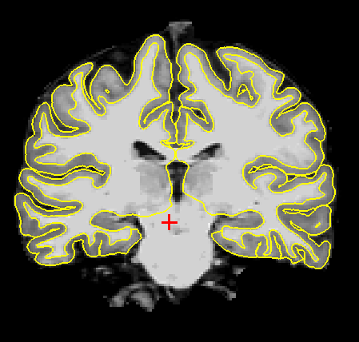
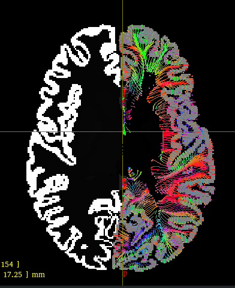

# Diffusion analysis of the cortex and superficial WM

This tutorial will show all the steps necessary to run the entire pipeline for the analysis of dMRI-derived metrics within the cortex and the superficial WM (SWM). **Please get in contact with us if you plan to use this pipeline.**

# Requirements
## Software
This pipeline includes several tools scattered around many different software suites, as well as some custom-made scripts and tools. In this tutorial we are using the computing cluster at the Institute of Neurobiology, at UNAM, where the tools are already installed. You may need to install them manually outside of our cluster. Some day we will create a singularity/apptainer container, but in the meantime here is the list of tools needed:

* [mrtrix3](https://mrtrix.readthedocs.io/en/latest/)
* [freesurfer](https://surfer.nmr.mgh.harvard.edu/)
* [ANTs](https://surfer.nmr.mgh.harvard.edu/)
* [workbench](https://www.humanconnectome.org/software/get-connectome-workbench)
* [micapipe](https://micapipe.readthedocs.io/en/latest/)
* [inb_tools](https://github.com/lconcha/inb_tools) (a collection of command-line tools used at our Institute).
* Custom-made [mrtrix modules](https://github.com/lconcha/inb_mrtrix_modules).

## Data
High-resolution, high-quality, multi-shell DWIs are needed. The very first steps of the pipeline assume the data is organized in BIDS format, but this is just a formality, as the pipeline is not a bona fide bids app. Data should be pre-processed and inside the `derivatives/` directory. Pre-processing of DWIs can be done with mrtrix's `dwifslpreproc`, but we love the denoiser in [Designerv2.](https://nyu-diffusionmri.github.io/DESIGNER-v2/)

For the purpose of this tutorial we have: 

```bash=
bids_dir=/misc/nyquist/danielacoutino/glaucoma/bids
subjid=sub-79864
```


# Run freesurfer
Create the directory where freesurfer outputs will be stored.  **All outputs from the corticalDWI pipeline are stored within this folder**. In this example, we set it to `/misc/sherrington/lconcha/TMP/glaucoma/fs_glaucoma`

## Prepare environment
In our cluster this is easy:

```bash
module load freesurfer/7.3.2
export SUBJECTS_DIR=/misc/sherrington/lconcha/TMP/glaucoma/fs_glaucoma
```
## Run freesurfer
First we prepare the inputs:
```bash
recon-all -subjid $subjid -i $bids_dir/${subjid}/anat/${subjid}_T1w.nii.gz
```
Then we run freesurfer:
```
fsl_sub -N $subjid -s smp,40 recon-all -threads 40 -subjid $subjid -all
```
As usual with freesurfer, it is now time to go do something else, drink some coffee, or read that stack of pdfs that keeps staring at you.

<details>
<summary>Details on SGE and SGE</summary>
Note that we are using `fsl_sub` to submit the job to the cluster. The `-N` flag just gives it a pretty name we can track using `qstat`, and `-s smp,40` assigns 40 slots to this job in a parallel environment. This is just a trick so that I know that my job is executed by a powerful PC (`qhost` can be used to examine the cluster capabilities). `-threads 40` is a flag for freesurfer (not for SGE), and instructs the program to use at most 40 threads, which we made it correspond to the slots requested in SGE.
</details>

### Check freesurfer output
Always make sure that your surface estimations are good. If not, refer to freesurfer's documentation and tutorials to [fix the surfaces using control points and/or voxel edits](https://sites.bu.edu/cnrlab/lab-resources/freesurfer-quality-control-guide/freesurfer-quality-control-step-1-fix-pial-surface/). 

One can check the surfaces with a command similar to:

```bash
freeview -v ${SUBJECTS_DIR}/$subjid/mri/brain.mgz -f ${SUBJECTS_DIR}/$subjid/surf/?h.{white,pial}
```



# Running corticalDWI
First we must prepare our environment, this will call for things in our `micapipe` environment.

```bash
module load ANTs/ workbench_con
conda activate micapipe  # crucial to do after module load to get the correct python in path
```

## Add the DWIs to the freesurfer file structure
This relies on a well-organized bids directory with the pre-processed dwi file. Soon we will add an option to manually specify the dwi file, but in the meantime...
```bash
 cortical_add_dwi_to_freesurfer.sh $subjid $bids_dir
```
This creates a `dwi/` folder inside the `$SUBJECTS_DIR/$subjid` directory:
```init
sub-79864/dwi
├── ad.nii.gz
├── b0.nii.gz
├── dt.nii.gz
├── dwi.bval
├── dwi.bvec
├── dwi.nii.gz
├── dwi.scheme
├── fa.nii.gz
├── mask.nii.gz
├── md.nii.gz
├── rd.nii.gz
└── v1.nii.gz
```

## Define parameters
```bash
nsteps=100
step_size="0.1"
tck_step_size=0.5
target_type=fsLR-32k
```

## Computing Laplacian field
```bash
cortical_compute_laplacian.sh $subjid
```

## Resample surfaces
```bash
for hemi in lh rh; do
  for surf_type in white pial; do
    cortical_resample_surface.sh $subjid $hemi $surf_type $target_type
  done
done
```
## Compute streamlines
```bash
for hemi in lh rh; do
  cortical_compute_streamlines.sh $subjid $hemi $target_type $nsteps $step_size
done
```
When each of these finishes, you can see in cyan the suggested command to check the results in mrview. It should look something like this:




## Register T1/dwi
This step uses `mri_synthseg` to segment both T1 and the DWIs, followed by registration of these two segmentations via ANTs. Oddly, `mri_synthseg` does not work well in freesurfer 7.4.
```bash
cortical_register_t1_to_dwi.sh $subjid
```