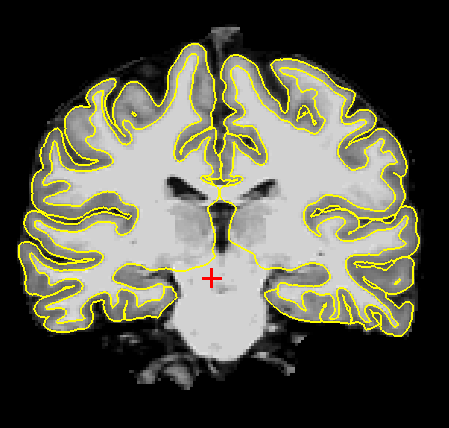
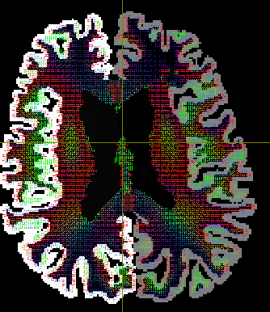
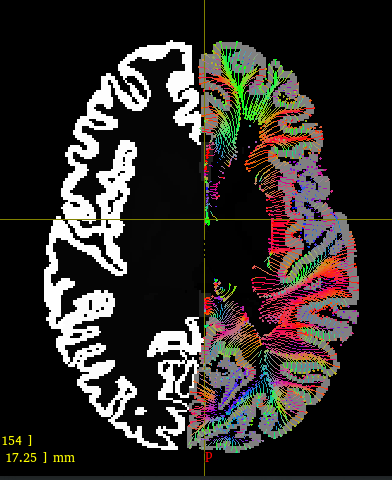
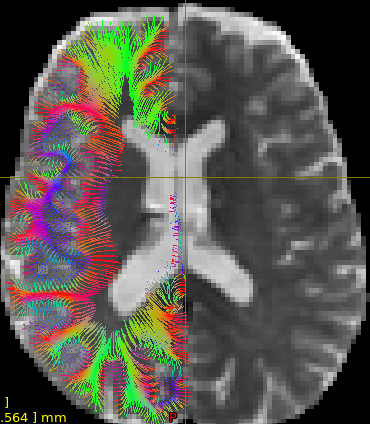
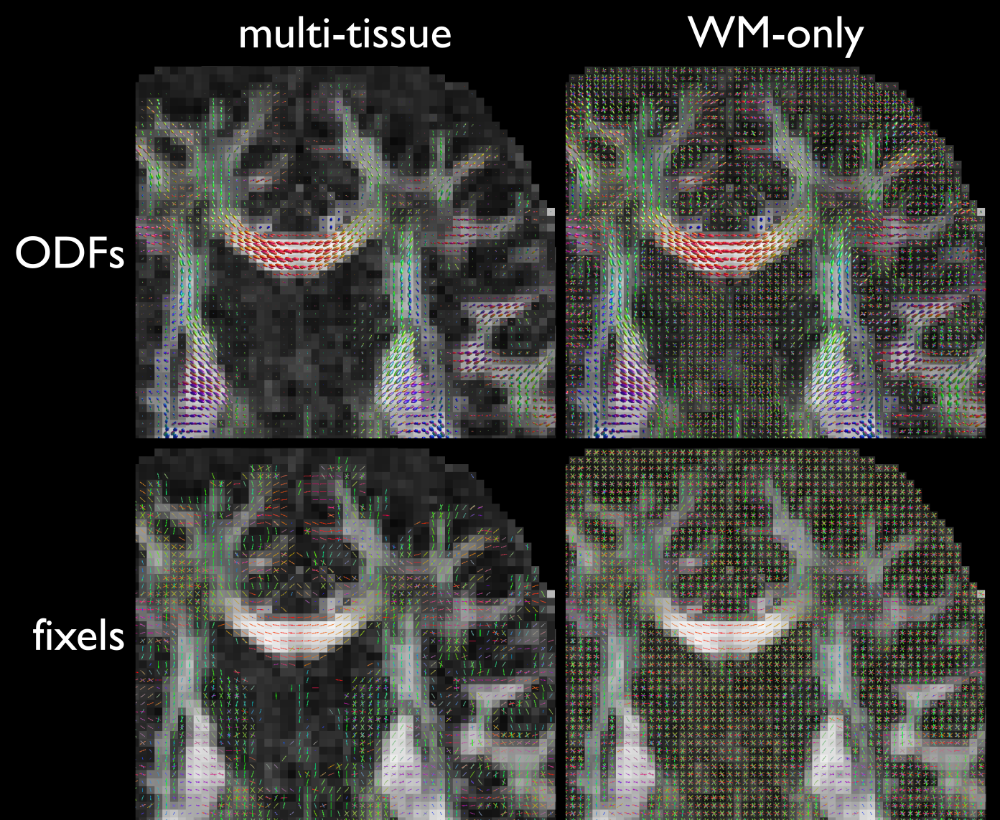

# Diffusion analysis of the cortex and superficial WM

This tutorial will show all the steps necessary to run the entire pipeline for the analysis of dMRI-derived metrics within the cortex and the superficial WM (SWM). **Please get in contact with us if you plan to use this pipeline.**

## Table of contents

- [Requirements](#requirements)
  - [Software](#software)
  - [Data](#data)
- [Run freesurfer](#run-freesurfer)
  - [Prepare environment](#prepare-environment)
  - [Run freesurfer](#run-freesurfer-1)
    - [Check freesurfer output](#check-freesurfer-output)
- [Running corticalDWI](#running-corticaldwi)
  - [Add the DWIs to the freesurfer file structure](#add-the-dwis-to-the-freesurfer-file-structure)
- [Run the CorticalDWI pipeline!](#run-the-corticaldwi-pipeline)
  - [Prepare configuration file](#prepare-configuration-file)
  - [RUN IT NOW, stop talking (tl;dr) :](#run-it-now-stop-talking-tldr)
  - [Running the pipeline with cortical_snakerun.py](#running-the-pipeline-with-cortical_snakerunpy)
    - [Listing available rules](#listing-available-rules)
    - [Running one rule, for one subject](#running-one-rule-for-one-subject)
    - [Running one rule for all subjects](#running-one-rule-for-all-subjects)
    - [Running the full pipeline](#running-the-full-pipeline)
    - [Running a specific set of rules](#running-a-specific-set-of-rules)
    - [Dry runs](#dry-runs)
    - [Checking progress with --status](#checking-progress-with---status)
    - [Local vs. cluster execution](#local-vs-cluster-execution)
    - [Cleaning up](#cleaning-up)
  - [Details about pipeline](#details-about-pipeline)
    - [Resample surfaces](#resample-surfaces)
    - [Compute streamlines](#compute-streamlines)
    - [Register T1/dwi](#register-t1dwi)
    - [Warp streamlines to DWI space](#warp-streamlines-to-dwi-space)
    - [Resample and truncate the streamlines](#resample-and-truncate-the-streamlines)
    - [CSD](#csd)
    - [MRDS](#mrds)
    - [Sample fixels](#sample-fixels)
    - [Other DWi models](#other-dwi-models)

# Requirements
## Software
This pipeline includes several tools scattered around many different software suites, as well as some custom-made scripts and tools. In this tutorial we are using the computing cluster at the Institute of Neurobiology, at UNAM, where the tools are already installed. You may need to install them manually outside of our cluster. Some day we will create a singularity/apptainer container, but in the meantime here is the list of tools needed:

* [mrtrix3](https://mrtrix.readthedocs.io/en/latest/)
* [freesurfer](https://surfer.nmr.mgh.harvard.edu/)
* [ANTs](https://surfer.nmr.mgh.harvard.edu/)
* [workbench](https://www.humanconnectome.org/software/get-connectome-workbench)
* [inb_tools](https://github.com/lconcha/inb_tools) (a collection of command-line tools used at our Institute).
* Custom-made [mrtrix modules](https://github.com/lconcha/inb_mrtrix_modules).
* mrds (ask Ricardo Coronado for it)

## Data
High-resolution, high-quality, multi-shell DWIs are needed. The very first steps of the pipeline assume the data is organized in BIDS format, but this is just a formality, as the pipeline is not a bona fide bids app. Data should be pre-processed and inside the `derivatives/` directory. Pre-processing of DWIs can be done with mrtrix's `dwifslpreproc`, but we love the denoiser in [Designerv2.](https://nyu-diffusionmri.github.io/DESIGNER-v2/)

For the purpose of this tutorial we have: 

```bash=
bids_dir=/misc/nyquist/danielacoutino/glaucoma/bids
subjid=sub-79864
```


# Run freesurfer
Create the directory where freesurfer outputs will be stored.  **All outputs from the corticalDWI pipeline are stored within this folder**. In this example, we set it to `/misc/sherrington/lconcha/TMP/glaucoma/fs_glaucoma`

## Prepare environment
In our cluster this is easy:

```bash
module load freesurfer/8.1.0
export SUBJECTS_DIR=/misc/sherrington/lconcha/TMP/glaucoma/fs_glaucoma
```
## Run freesurfer
First we prepare the inputs:
```bash
recon-all -subjid $subjid -i $bids_dir/${subjid}/anat/${subjid}_T1w.nii.gz
```
Then we run freesurfer:
```
fsl_sub -N $subjid -s smp,40 recon-all -threads 40 -subjid $subjid -all
```
As usual with freesurfer, it is now time to go do something else, drink some coffee, or read that stack of pdfs that keeps staring at you.

<details>
<summary>Details on SGE and SGE</summary>
Note that we are using `fsl_sub` to submit the job to the cluster. The `-N` flag just gives it a pretty name we can track using `qstat`, and `-s smp,40` assigns 40 slots to this job in a parallel environment. This is just a trick so that I know that my job is executed by a powerful PC (`qhost` can be used to examine the cluster capabilities). `-threads 40` is a flag for freesurfer (not for SGE), and instructs the program to use at most 40 threads, which we made it correspond to the slots requested in SGE.
</details>

### Check freesurfer output
Always make sure that your surface estimations are good. If not, refer to freesurfer's documentation and tutorials to [fix the surfaces using control points and/or voxel edits](https://sites.bu.edu/cnrlab/lab-resources/freesurfer-quality-control-guide/freesurfer-quality-control-step-1-fix-pial-surface/). 

One can check the surfaces with a command similar to:

```bash
freeview -v ${SUBJECTS_DIR}/$subjid/mri/brain.mgz -f ${SUBJECTS_DIR}/$subjid/surf/?h.{white,pial}
```



# Running corticalDWI
First we must prepare our environment, this will call for things in our `corticalDWI` environment.

If you have not yet created the `corticalDWI` python environment, you can do it with:

```bash
conda env create -f corticalDWI.yml
```

then

```bash
module load freesurfer/8.1.0 ANTs/2.4.4 workbench_con/2.0.1 mrtrix/3.0.4 mrds/1.2.0
export SUBJECTS_DIR=/misc/sherrington/lconcha/TMP/glaucoma/fs_glaucoma; # do not forget to set this after any time you load the freesurfer module. We had already loaded it, it is here just as a reminder that the pipeline works well on v7.3.2
conda activate corticalDWI  # crucial to do after module load to get the correct python in path
```

And, of course, add the corticalDWI repository (and `inb_tools`, if needed) to your PATH. In my case:
```bash
corticalDWI_repo=/datos/lauterbur2/lconcha/nobackup/MOVED_lauterbur/code/corticalDWI
export PATH=${corticalDWI_repo}:$PATH
```

## Add the DWIs to the freesurfer file structure
This relies on a well-organized bids directory with the pre-processed dwi file. Soon we will add an option to manually specify the dwi file, but in the meantime...
```bash
 cortical_add_dwi_to_freesurfer.sh $subjid $bids_dir
```
This creates a `dwi/` folder inside the `$SUBJECTS_DIR/$subjid` directory:
```init
sub-79864/dwi
├── dwi.bval
├── dwi.bvec
├── dwi.nii.gz
├── dwi.scheme
├── mask.nii.gz
```


# Run the CorticalDWI pipeline!

## Prepare configuration file
There should be a configuration file in you `$SUBJECTS_DIR` folder. All scripts will gather the default parameters from it. The majority of scripts are still callable with arguments, but if you want a cohesive analysis, this is a good way to do it. You can copy the [sample configuration file](./corticalDWI_params.conf).


## RUN IT NOW, stop talking (tl;dr) :
For each subject, simply run:
```bash
cortical_singlesubject_fullprocess.sh $subjid

```

You can check the status of the pipeline with:
```bash
cortical_status.sh
```
which should provide something like...
```
SUBJECT           Lapl    Sres    Str     Reg     Wtk     DTI     sDTI    CSD     sCSD    MRDS    sMRDS   DKI     T1      FLAIR 
----------------------------------------------------------------------------------------------------------------------------------------
sub-Mcd00202      ✓       ✓       ✓       ✓       ✓       ✗       RL      ✗       RL      ✗       RL      ✓       ✗       ✗       (8/19)
sub-Mcd004        ✓       ✓       ✓       ✓       ✓       ✓       ✓       ✓       ✓       ✓       RL      ✓       ✓       ✓       (17/19)
sub-Mcd005        ✓       ✓       ✓       ✓       ✓       ✓       RL      ✓       RL      ✓       ✓       ✓       ✓       ✓       (15/19)
sub-Mcd006        ✓       ✓       ✓       ✓       ✓       ✓       ✓       ✓       ✓       ✓       RL      ✓       ✓       ✓       (17/19)
sub-Mcd007        ✓       ✓       ✓       ✓       ✓       ✓       ✓       ✓       ✓       ✓       ✓       ✓       ✓       ✗       (18/19)
sub-Mcd008        ✓       ✓       ✓       ✓       ✓       ✗       RL      ✗       RL      ✗       RL      ✓       ✗       ✗       (8/19)
sub-Mcd009        ✓       ✓       ✓       ✓       ✓       ✗       RL      ✗       RL      ✗       RL      ✓       ✗       ✗       (8/19)
sub-Mcd010        ✓       ✓       ✓       ✓       ✓       ✗       RL      ✗       RL      ✗       RL      ✓       ✗       ✗       (8/19)
sub-Mcd012        ✓       ✓       ✓       ✓       ✓       ✗       RL      ✗       RL      ✗       RL      ✓       ✗       ✗       (8/19)
----------------------------------------------------------------------------------------------------------------------------------------
Total: 107 / 171 steps done across 10 subject(s) (62%) for target type ico6_sym
```

`cortical_singlesubject_fullprocess.sh` runs every step in a fixed, hardcoded order and `cortical_status.sh` reports progress off a hand-maintained manifest. Both still work, but the recommended way to actually drive the pipeline is `cortical_snakerun.py`, described next: it runs the exact same underlying `cortical_*.sh`/`.py` scripts, but through a real Snakemake dependency graph (so it only reruns what's actually missing or stale, and pulls in prerequisites automatically), and its rule list/status can never drift out of sync with [rules/](./rules/) the way a hand-maintained script can.

## Running the pipeline with cortical_snakerun.py

`cortical_snakerun.py` is a thin wrapper around the Snakemake orchestration in [Snakefile](./Snakefile) and [rules/](./rules/). On every call it discovers each rule's target pattern and thread count live (via `snakemake -n --forceall`), so its rule listing can never drift out of sync with the rules themselves.

It needs the same environment set up as above: `module load ...`, `SUBJECTS_DIR` exported, the `corticalDWI` conda environment active, and the repo on your `$PATH`.

### Listing available rules

Called with no arguments, it prints usage plus every rule currently discovered, its target pattern, and its thread count:

```bash
cortical_snakerun.py
```

```
(Rules in the pipeline (discovered using subject 'sub-79864')

  laplacian                   threads=1   .../mri/laplace-wm_vec.nii.gz
  resample_surface_ico6_sym   threads=1   .../surf/lh.ico6_sym.white.surf.gii
  compute_streamlines         threads=1   .../dwi/streamlines.tck
  register_t1_to_dwi          threads=8   .../dwi/t1native_to_b0_Warped.nii.gz
  warp_tck_to_dwi             threads=1   .../dwi/streamlines_dwi.tck
  dti                         threads=4   .../dwi/dti_FA.nii.gz
  csd_individual_response     threads=1   .../dwi/response_wm.txt
  csd_average_response        threads=1   .../group/average_response_wm.txt
  csd_compute_fod             threads=4   .../dwi/wmfod.mif
  mrds                        threads=18  .../dwi/mrds_fixels/...
  ...
```

### Running one rule, for one subject

This is the everyday case: the snakerun equivalent of calling `cortical_DTI.sh $subjid` directly, except it only actually runs if the outputs are missing or stale, and any missing prerequisite (e.g. the registration step, for a rule that needs dwi-space files) is pulled in and run first automatically:

```bash
cortical_snakerun.py dti sub-79864
```

Extra arguments after the subject are passed straight through to snakemake — e.g. force a rerun even though the outputs already exist with `-R`:

```bash
cortical_snakerun.py mrds sub-79864 -R
```

Rules with no `{subject}` in their pattern (group-wise rules, e.g. the CSD response average) are called with no subject at all:

```bash
cortical_snakerun.py csd_average_response
```

### Running one rule for all subjects

Pass `--all-subjects` instead of a subject name to run a rule for every non-skipped `sub-*` directory found in `$SUBJECTS_DIR` (a subject is considered "skipped" if its directory contains a file named `skip`):

```bash
cortical_snakerun.py dti --all-subjects
```

By default this still processes subjects one at a time, sized to just one job's threads — see [Local vs. cluster execution](#local-vs-cluster-execution) below for running several subjects concurrently.

### Running the full pipeline

Use `--all-rules` to run every rule for one subject:

```bash
cortical_snakerun.py --all-rules sub-79864
```

...or for every subject at once — the snakerun equivalent of looping `cortical_singlesubject_fullprocess.sh` over all subjects, except Snakemake skips whatever each subject has already completed:

```bash
cortical_snakerun.py --all-rules --all-subjects
```

`--all-rules` with no subject and no `--all-subjects` is equivalent to running plain `snakemake` with no explicit targets (its default `rule all`) — every non-skipped subject, every rule.

### Running a specific set of rules

Use `--rules` (comma-separated whitelist) or `--skip` (comma-separated blacklist) in place of a single rule name. Both combine with a subject or `--all-subjects`:

```bash
cortical_snakerun.py --rules dti,dki sub-79864
cortical_snakerun.py --skip mrds --all-subjects
```

`--skip` also walks the dependency graph forward and skips anything downstream that would otherwise pull the skipped rule's output back in as a dependency, and tells you what it auto-skipped.

Give at most one of `--all-rules`, `--rules`, or `--skip` at a time.

### Dry runs

`--dry-run`/`-n` works with any of the invocations above — handy for previewing an `--all-subjects`/`--all-rules` call before committing to it:

```bash
cortical_snakerun.py dti --all-subjects --dry-run
```

`--quiet`/`-q` similarly works with any of them, and trims Snakemake's own boilerplate (DAG-building notices, etc.) while still showing job stats and any real errors.

### Checking progress with --status

`--status` prints a `cortical_status.sh`-style table: one row per subject, one numbered column per subject-scoped rule (a footnote below the table maps each number back to its rule name), plus a separate "Group-wise rules" section for rules like `csd_average_response` that aren't tied to any one subject:

```bash
cortical_snakerun.py --status
```

Restrict it to specific subjects by listing them:

```bash
cortical_snakerun.py --status sub-79864 sub-79291
```

For digging into a single subject, there are a few more introspection flags:

```bash
cortical_snakerun.py --subject-status sub-79864                # one line per rule: check/cross + n/m outputs present
cortical_snakerun.py --subject-outputs sub-79864                # every file some rule declares as output, marked ✓/✗
cortical_snakerun.py --subject-outputs sub-79864 --under mri    # ...restricted to files under sub-79864/mri/
cortical_snakerun.py --subject-raw-inputs sub-79864             # raw/external files some rule reads but none produces
```

### Local vs. cluster execution

By default `cortical_snakerun.py` runs **locally**, sized to just the selected rule's (or rules') own declared thread count — nothing extra to configure for a single-subject, single-rule call:

```bash
cortical_snakerun.py mrds sub-79864
```

To run several jobs concurrently on the same machine (e.g. `dti` for several subjects at once), pass your own `--cores` as an extra argument — Snakemake treats it as the total local core budget and packs concurrent jobs to fit inside it, honoring each rule's declared `threads:`:

```bash
cortical_snakerun.py dti --all-subjects --cores 32
```

:warning: Always pass `--cores`, never a bare job count like `-j4`, for a local multi-job run. Without `--cores`, Snakemake schedules every job as needing only 1 slot regardless of its real `threads:` — so, for example, several `mrds` jobs (each wanting many threads) could be scheduled concurrently and badly oversubscribe the machine.

To submit to the **cluster** instead, add `--cluster`. This submits through whatever Snakemake profile is currently deployed at `$SUBJECTS_DIR/.corticalDWI/snakemake_profile/` — copy a profile there first (a template lives in [profiles/sge_don_clusterio](./profiles/sge_don_clusterio)):

```bash
mkdir -p $SUBJECTS_DIR/.corticalDWI
cp -r $corticalDWI_repo/profiles/sge_don_clusterio $SUBJECTS_DIR/.corticalDWI/snakemake_profile

cortical_snakerun.py mrds sub-79864 --cluster
cortical_snakerun.py dti --all-subjects --cluster    # submits one job per subject to the cluster
```

Under `--cluster`, per-job resources (e.g. SGE slots) come from the profile's own cluster-sync configuration, not from `--cores` — so `--cores` has no effect there. To target a different cluster, copy a different profile's `config.yaml` into that same deployed location.

To use a one-off profile without overwriting whatever is currently deployed, pass `--profile <dir>` directly instead of `--cluster` — the two are mutually exclusive:

```bash
cortical_snakerun.py mrds sub-79864 --profile /path/to/other_profile
```

### Cleaning up

To reset a subject (delete every rule's declared output for it) or just one rule's outputs for a subject, use `--delete sub-X` or `--delete-rule <rule> sub-X` (or `--delete-rule <rule> --all-subjects`) — both accept `--dry-run`/`-n` to preview first:

```bash
cortical_snakerun.py --delete sub-79864 --dry-run
cortical_snakerun.py --delete-rule mrds sub-79864
```

Run `cortical_snakerun.py -h` at any time for the full built-in reference (this section mirrors it, but the `-h` output is always current for whatever rules are deployed).

## Details about pipeline
If you want to know more aboout what goes on in the pipeline, keep reading.


Define parameters

```bash
nsteps=100
step_size="0.1"
tck_step_size=0.5
target_type=fsLR-32k
```
And get your Laplacians.

```bash
cortical_compute_laplacian.sh $subjid
```


Results are saved in the `mri` folder, since the Laplacian field is calculated in the T1 native space. Later on we will be able to move the laplacian streamlines to the dwi space. Check your result:

```bash
mrview ${SUBJECTS_DIR}/$subjid/mri/aparc+aseg.nii.gz -fixel.load $subjid/mri/laplace-wm_vec.nii.gz
```



### Resample surfaces
This resamples the freesurfer's white and pial surfaces to whatever `$target_type` you want, typically `ico6_sym`. This is a custom-made surface based on a sixth order icosahedron. The beauty of this template is that it will allow us to have _very_ good vertex-wise inter-hemispheric correspondence per subject, improving asymmetry analyses.  It will also create surfaces with scanner coordinates, which we will use to compute the streamlines in the next step. Results are saved in the `surf` folder.
```bash
cortical_resample_surface_ico6_sym.sh $subjid
```
### Compute streamlines
```bash
cortical_compute_streamlines.sh $subjid
```
When it finishes, you can see in cyan the suggested command to check the results in mrview. It should look something like this:




### Register T1/dwi
This step uses `mri_synthseg` to segment both T1 and the DWIs, followed by registration of these two segmentations via ANTs. Ideally, use a PC with at least 32 GB of RAM and plenty of CPU threads.
```bash
cortical_register_t1_to_dwi.sh $subjid
```

The command itself will tell you how to check your results. Use the <kbd>PgUp</kbd> and <kbd>PgDn</kbd> keys to switch between volumes, and make sure that the registration is as good as can be. Check the cortex in the frontal and temporal poles.


### Warp streamlines to DWI space
Streamlines were created in t1 native space, because that is where the surfaces were generated. However, what we want to sample is in dwi space. Now, _we could_ transform all DWI-derived maps to t1 space and sample there, but that would be a hassle, since we would need to transform all vector-related stuff (fixels, principal diffusion directions, etc). So, instead we bring the t1-derived streamlines over to the dwi world.
```bash
cortical_warp_tck_to_dwi.sh $subjid
```
When the script finishes, it will tell you how to visualize the results, go ahead and check that the streamlines are truly in dwi space. This is crucial, or else we will sample some other trash!




### Resample and truncate the streamlines
To ensure correct sampling as a function of depth from the pial surface, we should ensure equidistant points between the vertices of each streamline according to our desired spatial sampling rate (step size). While we're at it, we truncate the streamlines after a certain depth. This will allow us to visualize only what we are truly sampling.


### CSD
Now we compute constrained spherical deconvolution across the entire brain, including the fixels directory that we will then use to extract apparent fiber density per fixel.
This requires three steps:

1. Compute response functions (per-subject)
2. Average all response functions (group-wise)
3. Compute FODs using the average response function (per-subject)

The corresponding order of scripts is:

```bash
cortical_CSD_individual_response.sh $subji
cortical_CSD_average_response.sh
cortical_CSD_compute_fod.sh $subjid
```

Two versions of CSD will be computed, each with its own advantages and disadvantages.

* **Multi-shell multi-tissue.** This creates beautiful FODs all throughout the brain. It is very favoured by folks doing tractography, as the WM fods are sharper and cleaner from partial volume effects of gray matter and CSF. However, since the response function for gray matter is spherical on purpose, it is impossible to obtain per-bundle AFD metrics in the cortex. So, this may be a good option for analysis of superficial white matter, but not so much for intra-cortical analysis.
* **Multi-shell single tissue.** A single response functio is estimated for white matter, and applied throughout the brain, even in the cortex. This effectively allows us to obtain per-bundle metrics (AFD) in the cortex. There is a possibility of finding spurious fixels in the cortex that arise from diffusion of mostly isotropic components therein, but we assume here that any large fixels correspond to "neurites", which should have a response function similar to that found in deep white matter. This is an important assumption, and something to always consider when intepreting results.



### MRDS
Here we fit one, two, or three tensors to each voxel throughout the brain using multi-resolution discrete search [(Coronado-Leija, Ramírez-Manzanares & Marroquín, 2017)](https://doi.org/10.1016/j.media.2017.06.008). The optimal number of tensors that best explain the underlying signal (per voxel) is estimated with Bayes' information criterion (BIC). This is a _very_ time-consuming step, expect around 24 per subject on a multi-core workstation! You have been warned! 

```bash
cortical_MRDS.sh $subjid
```
:information_source: Let's focus on CSD for this tutorial and skip MRDS.


### Sample fixels
Ah, the final frontier! Let's get the AFD values along the laplacian streamlines, separating those derived from the FODs mostly aligned parallel to the streamline, to those that are perpendicular to it; the first is related to radial fibers entering and exiting the cortex to and from the deep white matter, while the second represents fibers running tangential to the pial surface, likely inter-columnar fibers (within the cortex) and U-fibers (in the superficial white matter). To make nomenclature clear:


| Geometric relation to Laplacian streamline | Fiber population | Biological interpretation        |
|--------------------------------------------|------------------|----------------------------------|
| parallel                                   | radial fibers    | cortical afferents and efferents |
| perpendicular                              | tangential       | inter-columnar and U-fibers      |

In this tutorial we will sample the single-tissue fixels, so that we get (meaningful) results from the voxels within the cortical ribbon.

We must have the custom-made mrtrix modules in our `$PATH`. They can be obtained [here](https://github.com/lconcha/inb_mrtrix_modules). These modules are modifications (hacks, really) of the commands `tckfixel` and `tcksample` in the original mrtrix implementation. The modification allows for:
* the calculation of the dot product between each streamline segment and the underlying fixel(s)
* sampling the per-fixel AFD, and assignment to either radial or tangential fibers. 
  * The fixel showing the largest dot product to the streamline segment is assigned as **parallel**.
  * **Perpendicular** can be defined in two ways: either the most perpendicular (i.e., lowest dot product), or the average of all fixels except the one defined as parallel. Both are supplied as results.

### Other DWi models
Some DWI metrics are not fixel-based (e.g., DTI, DKI metrics), and therefore do not specify par or perp.

```bash
cortical_tcksample_dti.sh $subjid $nDepths
cortical_tcksample_dki.sh $subjid
```

